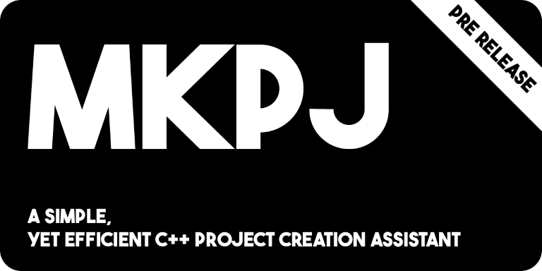

# MKPJ
> a simple command line tool used to create simple C++ projects !

## What it does ?

`mkpj` is a simple yet very useful program that lets you create projects folder as well as adding hpp/cpp files and download utility [pairs](##pairs).
It can also create QT projects : adding the resources, interface, and config folders who contains a .json config file, a .ui file, a .qrc file, and it adds a .pro file to the root of the folder.
Theses projects follow a simple yet efficient template:

```
project_name/
 ├── bin/
 ├── include/
 │   └── *.hpp
 ├── src/
 │   └── *.cpp
 ├── obj/
 ├── Makefile
 ├── .mkpj.conf
 ├── .pairs.conf
 └── README.md
```


QT project template :
```
project_name/
 ├── bin/
 ├── config/
     └── conf.json
 ├── interface/
     └── *.ui
 ├── resources/
     └── *.qrc
 ├── include/
 │   └── *.hpp
 ├── src/
 │   └── *.cpp
 ├── obj/
 ├── Makefile
 ├── .mkpj.conf
 ├── .pairs.conf
 └── README.md
 │   project_name.pro
 ```

The `mkpj` programm creates a Makefile based on the inputs you specified.  
The Makefile includes the `all`, `install` and `clean` targets. (The `install` target shall be run as root).

By default, make will put the object files (.o) in the `obj` folder and output the binary in the `bin` folder.

<br>

## How to use ?

To create a project, `mkpj` will ask you several questions such as
- The project name
- If it is a QT project
- The target (the ouput from the Makefile)
- The output file extension 

Just type
```
$ mkpj -c
```
to create a new project.

You can also use
```
$ mkpj -m
```
to re create the Makefile of an existing project, it is useful if you edited the configuration file (`.mkpj.conf` at the root of your project).

You can add a hpp/cpp combo to your project using
```
$ mkpj -a
```

You can add a pair to your project using
```
$ mkpj -p <pair_name>
```
see the [Pairs](##pairs) section for more information.

You can see the languages that can be created with mkpj, by typing
```
$ mkpj -g
```

Finally, you can use
```
$ mkpj -t
```
to export the project to a tarball.
> You can add additionnal files to the tarball by modifying the `additional_files` property in the `.mkpj.conf` file at the root of your project.

<br>

## Pairs
> Since version 0.6 mkpj can download pairs of files from the internet.  

The pairs are simple utility classes that can be used in your projects.
You can find the list of available pairs [here](https://github.com/BaptisteP31/mkpj-core/tree/main/pairs).  

You can add your own pairs by adding them to the `pairs` folder in the `mkpj-core` repository and making a pull request. We will review your pair and add it to the list if it is relevant.

If you want to get more information about the pairs, you can check the [mkpj-core](https://github.com/BaptisteP31/mkpj-core) repository wich contains the pairs as well as a more in depth documentation containing a template for the pairs and a guide on how to create your own pairs.  

To list the available pairs, use
```
$ mkpj -l
```

To download a pair, use
```
$ mkpj -p <pair_name>
``` 
<br>

## Compilation
> GNU g++ is expected to be present on the system, as well as libcurl.  


To check if libcurl is installed on your system, use
```
$ ldconfig -p | grep libcurl
```

You shall prepare the project for compilation using
```
$ make configure
```

You can compile the programm on your system using
```
$ make
```
It will generate a mkpj file in the `bin` folder.  
You can already use this binary file to execute the program but it is recommanded to install it.  

<br>

## Installation

> The installation via homebrew or via the binary is recomeùnded for beginners.

> mkpj is now available on homebrew !
### Using homebrew (linux and macos):
```
$ brew tap BaptisteP31/mkpj
```
and then
```
$ brew install mkpj
```
More info on homebrew [here](https://brew.sh/).

### From source:  
On linux, use
```
# sudo make install
```
to install the program in the `/usr/local/bin` folder.

### From binary:
> **If you don't want to compile from the source, you can use the provided binary in the release section of the repository.**  

To install the binary file on linux, use
```
# sudo mv mkpj /usr/local/bin
```

<br>

---
This projects uses part of the [CXXOPTS project](https://github.com/jarro2783/cxxopts).
